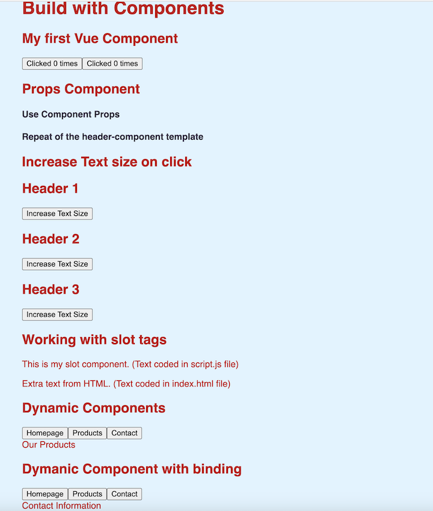

# 2ndVuePorject

A coding tutorial created to utilize Vue for the first time. Completed through Mammoth Interactive at [link to Mammoth Interactive Homepage](https://training.mammothinteractive.com/courses).

## Tech Used
- Vue
- JavaScript
- HTML
- CSS

## Dependencies
Vue, @vitejs/plugin-vue, Vite

## Uses
This project showed me how to build components with Vue. This included building a simple count button, reusing components, using props, emiting an event (change text size on click), using a slot to code text in the js and HTML files, and build dynamic comonents with and without binding.

## How I veered from the original project
- all of the example code is in the same file. So when npm run dev is ran all of the code is in one place to review.

## History
After completing a Software Engineering certification program and during my job search, I needed to continue to pracitce my skill set in order to maintain it and learn more. The course did not spend a lot of time using Vue, beyond introducing it as one of a few JavaScript frameworks.

## Screenshot 


## Recommended IDE Setup

[VSCode](https://code.visualstudio.com/) + [Volar](https://marketplace.visualstudio.com/items?itemName=Vue.volar) (and disable Vetur) + [TypeScript Vue Plugin (Volar)](https://marketplace.visualstudio.com/items?itemName=Vue.vscode-typescript-vue-plugin).

## Customize configuration

See [Vite Configuration Reference](https://vitejs.dev/config/).

## Project Setup

```sh
npm install
```

### Compile and Hot-Reload for Development

```sh
npm run dev
```

### Compile and Minify for Production

```sh
npm run build
```
